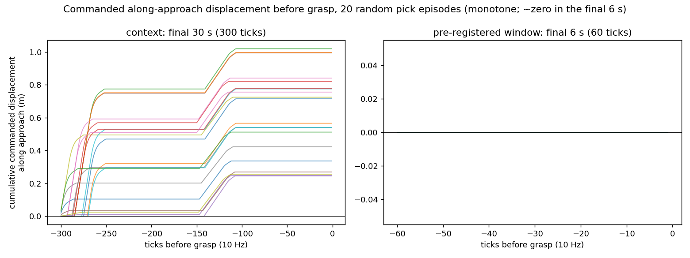
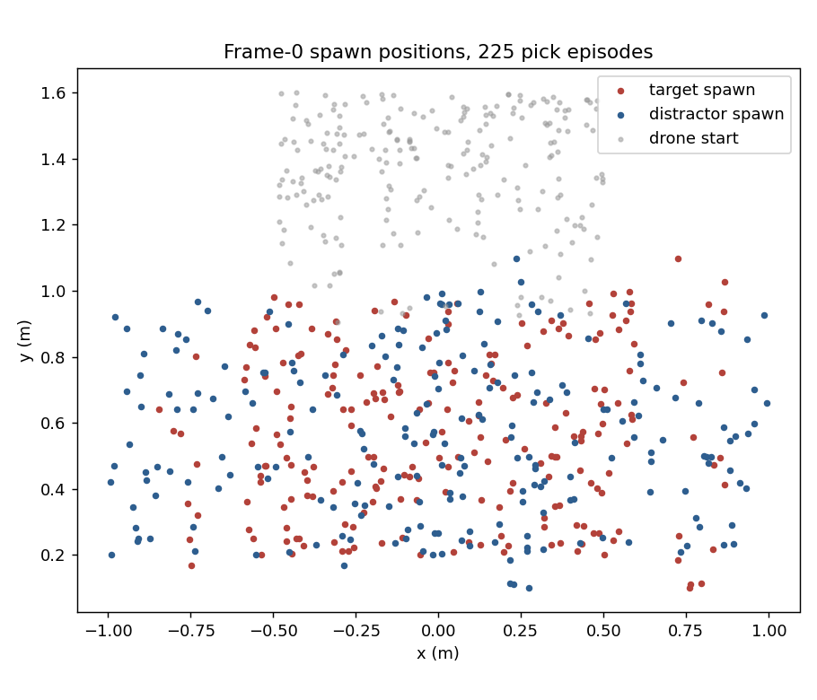

# Dataset tests: do the demonstrations justify a v2 collection campaign?

Two tests, both reading only the existing dataset tables (`hanapasta/airvla_full`,
400 episodes, 225 picks; copied out read-only, no GPU, no simulation, no
queue use). Scripts: `reversal_probe.py`, `position_shortcut.py`. Run
2026-08-31 on the local machine against a snapshot of the parquet tables.

## Pre-registered decision rules

Stated before the numbers were computed (they are also printed by each
script ahead of its results):

1. **Reversal test**: if ≥40% of pick episodes contain a commanded backward
   excursion >2 cm in the final 6 s before the grasp, the reversal is a real
   feature of the training data. The next step is then the cheap test —
   filter to non-reversal episodes, retrain, evaluate — not a collection
   campaign. Report the survivor count.
2. **Position-shortcut test**: if any single position-style shortcut
   identifies the target >70% of the time, language is redundant in the
   training data and the inert prompt (decision log D50) is a dataset-design
   consequence; the fix is re-collection with the target location
   randomised. If every shortcut is near 50%, the language was genuinely
   necessary and the model failed to learn it — pointing at the model or
   the training recipe, not the collector.

---

## Test 1 — Does the expert reverse before grasping?

**No. There are no commanded reversals anywhere in the dataset — the
commanded lateral motion in the final 6 s is exactly zero.**

Method: per pick episode, grasp tick = last open→closed crossing of the
commanded grip channel (`action[6] < 0.9`, the collector's own threshold);
project each commanded `(dx, dy)` in the 60 ticks before it onto the unit
vector from the drone's window-start position to the object's grasp-tick
position; 1 mm deadband; count sign flips and the largest backward
excursion of the cumulative sum. Repeated on measured body position
(`observation.state`) as context.

| Quantity | Commanded actions (the labels) | Measured position (context) |
|---|---|---|
| episodes analysed / skipped | 225 / 0 | 225 / 0 |
| ≥1 sign change after deadband | 0/225 (0%) | 0/225 (0%) |
| backward excursion > 2 cm | **0/225 (0%)** | 0/225 (0%) |
| median · max backward excursion | 0.0 mm · 0.0 mm | 8.6 mm · 10.5 mm |
| by object | weight 0/100, penguin 0/125 | — |

The final-approach window is not merely monotone — it is empty: the median
**and maximum** total commanded along-approach displacement in the final
6 s is 0.0 mm. The 30 s context panel in `reversal_overlay.png` shows why:
the scripted expert advances in two forward pulses and is parked over the
object about 11 s before the grip closes; the grasp phase itself commands
no lateral motion at all. The ~9 mm excursions in measured position are
settle jitter of the platform, present while the command is zero.

**Decision (rule 1): 0% ≪ 40%. The reversal hypothesis is dead.** There is
nothing to filter — 225/225 episodes survive a no-reversal filter — and no
retraining experiment to run. Whatever makes fifty-action open-loop
execution hard, it is not back-and-forth labels in the final approach.

---

## Test 2 — Is the target identifiable from position alone?

**No. Position carries essentially no information about which object is
the target — the best cross-validated position rule scores 52.3%.**

Frame-0 layout, verified against `collect_airvla.Runner.scene_state`
(`[0:7]` task object pose, `[7:14]` distractor pose): the two objects sit
side by side on the table at **exactly the same y** in every episode
(max |Δy| = 0.0), with the distractor offset in x by 0.13–0.62 m,
symmetrically left or right (111 vs 114 episodes).

| Spawn (m) | x mean | x std | x range | y mean | y std | y range |
|---|---|---|---|---|---|---|
| target | 0.021 | 0.431 | 1.713 | 0.563 | 0.240 | 0.997 |
| distractor | 0.012 | 0.537 | 1.987 | 0.563 | 0.240 | 0.997 |

Overlap: 100% of target spawns fall inside the distractor's bounding box
(85.8% the other way — the distractor's x range is slightly wider).

| Shortcut rule | Accuracy |
|---|---|
| closer to mean target xy (nearest-centroid, in-sample) | 57.8% |
| **best attempt: paired logistic on position features, 10-fold CV** | **52.3%** |
| nearer to the drone's start | 54.2% |
| identity majority (weight 100 / penguin 125; penguin is the larger object) | 55.6% |

The 57.8% nearest-centroid figure is in-sample optimism; the honest
cross-validated ceiling is 52.3%, i.e. chance. No rule approaches 70%.

**Decision (rule 2): the near-50% branch fires.** The dataset did **not**
make language redundant — the prompt noun was the *only* cue that
identified the target, in every episode. The behaviourally inert prompt
measured in D50 is therefore a **model/training failure, not a collector
design flaw**, and this **falsifies the mechanism previously recorded in
D50** ("training always placed the prompted object at the task spot"),
which was inferred from the eval probe rather than measured from the
dataset. A correction is filed in the decision log.

---

## Joint implication for a v2 collection campaign

Neither test justifies re-collection. The demonstrations are monotone
(nothing pathological for open-loop execution in the labels' final
approach) and already position-decorrelated (language was necessary by
construction). Both of the failures the campaign would have fixed live on
the model/training side instead: the policy never learned to condition
object selection on the noun despite 225 episodes where that was the only
disambiguating signal, and it under-tracks laterally despite clean labels.

One connection worth carrying forward as a hypothesis (not a conclusion):
a policy that cannot resolve *which* of two side-by-side objects is the
target should show exactly the eval signatures we have measured — a
partial lateral slope (0.40), prompt-invariant selection on paired scenes,
and a bimodal response when handed an oracle target vector. If target
*selection* rather than target *tracking* is the bottleneck, the highest-
leverage training-side interventions are language-conditioning ones
(e.g. more balanced prompt-noun exposure, longer training on the existing
labels, or auxiliary supervision tying the noun to position), not new
demonstrations.
